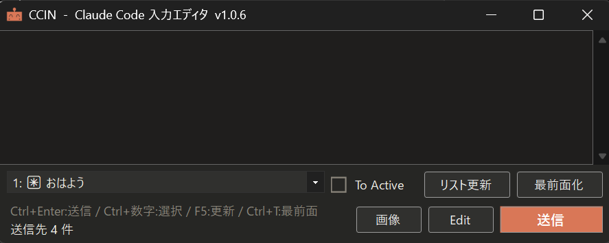
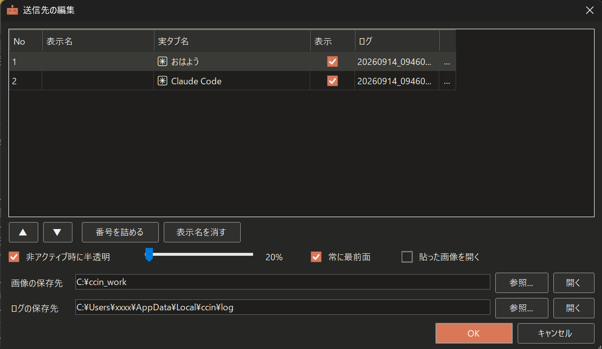

# CCIN(ｸｯｷﾝ)

## Toolの概要
Windows Terminalから起動されたClaude Codeに送る文章を、じっくり書いてから送るための入力エディタにゃ。
★★注意★★
使い方を読まずに使用すると誤動作による大損害が起きる危険があります。最後までしっかり読んでから、ご利用ください。

## 動作環境
Windows 10 / 11（64bit）＋ Windows Terminal ＋ Claude Code

## 導入方法
ZIP を好きなフォルダに展開し `ccin.exe` を実行にゃ。
インストーラは無いにゃ。

## アンインストール方法
フォルダごと削除してにゃ。
設定は `%LocalAppData%\ccin\` に残るので、完全に消すならそこも消してにゃ。

## 使い方
### 起動方法
Zipファイルを解凍してccin.exeをダブルクリックして起動しますにゃ。

### 画面1. Claude Code入力エディタウィンドウ

- 1. テキスト入力エリア
ここに、Claude Codeに送る文章を書きます。改行を使用できますにゃ。

- 2. ドロップダウンリスト
起動中のTerminalが表示されますにゃ。

- 3. 送信ボタン
【テキスト入力エリア】に入力されたテキストを、
【クリップボード】にコピーし、【ドロップダウンリスト】で選択されたウィンドウに送信しますにゃ。

- 4. リスト更新ボタン
起動中のTerminalを確認し【ドロップダウンリスト】を最新にしますにゃ。

- 5. 最前面化ボタン
【ドロップダウンリスト】で選択されたウィンドウを最前面に持っていきますにゃ。

- 6. 画像ボタン
Win+Shift+S+範囲選択にてキャプチャし、【画像】ボタンを押すと、
クリップボードに保存されいるスクショを【画像の保存先】で指定されたフォルダに【日時.png】で保存し、
【テキスト入力エリア】の一番下の行にフルパスをテキストで入力しますにゃ。

- 7. Editボタン
【画面2. 送信先の編集ウィンドウ】を開きますにゃ。詳細は次の項目にて。

- 8. To Activeチェックボタン
【ドロップダウンリスト】を無効化し操作できなくなりますにゃ。
代わりに2秒ポーリングにて画面を監視し、【ドロップダウンリスト】を更新しますにゃ。
そして、現在ActiveになっているClaude Codeを自動でドロップダウンリスト選択状態にし、【送信】できるようにしますにゃ。

★★注意★★
2秒ポーリングのため、「ウィンドウを選択 → 送信」を2秒未満でやると、意図しないウィンドウに送られる可能性があります。
【送信】する場合は、かならず【ドロップダウンリスト】に送りたいウィンドウが選択状態にあることを目視確認してください。にゃ。

- 9. ショートカット
Ctrl+Enter:送信
Ctrl+数字:Claude Codeウィドウ切り替え
F5:リスト更新
Ctrl+T:最前面化ON,OFF

- 10.ステータス表示
CCINの状態を表示します。エラーなどがあればここに表示します。にゃ。

### 画面2. 送信先の編集ウィンドウ

- 1. リスト 【ドロップダウンリスト】に表示する現在開いているウィンドウの一覧です。にゃ。

-- 1. No
開いた順番に番号が振られます。ウィンドウが閉じられ欠番すると、新しくウィンドウが開かれたときに空いてる番号入ります。にゃ。

-- 2. 表示名
【ドロップダウンリスト】に表示させる名前を自分で決めることができます。にゃ。

-- 3. 実タブ名
【ドロップダウンリスト】で表示するウィンドウにつけられた名前を表示します。にゃ。

-- 4. 表示
【ドロップダウンリスト】に表示する・しないを切り替えられます。にゃ。

-- 5. ログ
【送信】を実行すると、送ったプロンプトの履歴をここで指定した名前のログファイルに保存されます。にゃ。
ログファイル名はCCIN起動時に決まります。起動時の【日時_枝番.log】になります。変更することも可能です。にゃ。

-- 6. ...
ログファイルを直接開きたいときに押します。ない場合は開けません。にゃ。

- 2. ▲ ▼
【リスト】の順を変更することができます。変更すると【ドロップダウンリスト】に表示される順番が変わります。にゃ。

- 3. 番号を詰める
Tarminalを開いたり閉じたりを繰り返すと、【No】に欠番がでたりするので、空いてる番号を詰めることができます。にゃ。

- 4. 表示名を消す
自分で設定した表示名を消して、【ドロップダウンリスト】に【実タブ名】を表示することができます。にゃ。

- 5. 非アクティブ時に半透明
CCINのウィンドウを非アクティブ時に半透明化することができます。常に最前面にした時に便利です。にゃ。

- 6. 常に最前面
CCINを常に最前面にします。にゃ。

- 7. 貼った画像を開く
メインウィンドウにて【画像】ボタンを使用し、クリップボードから作成された画像のプレビューの表示する・しないを切り替えることができます。にゃ。

- 8. 画像の保存先
【画像】ボタンを押したときの画像の保存先を指定します。にゃ。

- 9.ログの保存先
ログの保存先を指定します。にゃ。

## ★★やってはいけない操作★★
1. 本ツールは、CCINに入力されたテキストはクリップボードを経由し、ウィンドウに張り付けられます。
【送信】ボタンを押したら、「テキストがClaude Codeに送信されるのを確認するまで、画面操作を行わないでください。」
また、CCINを外部ツールなどから自動入力もしないでください。
クリップボードが混線し、意図しないプロンプトを別のウィンドウに張り付けたりすることになります。

2. 【To Activeチェックボタン】にも書きましたが、2秒ポーリングのため、
「ウィンドウを選択 → 送信」を2秒未満でやると、意図しないウィンドウに送られる可能性があります。
送信する場合は、かならず【ドロップダウンリスト】に送りたいウィンドウが選択状態にあることを「目視確認」してください。

3. Windows Terminalの素シェルなども【ドロップダウンリスト】に認識されます。(VS Code や Cursorの内臓ターミナルは対象外)
Claude Codeなどが起動されていない素のWindows Terminalなどは複数行入力に対応していません。
複数行を送ろうとすると意図しない動きになります。送らないでください。【Editボタン】から【表示】のチェックを外してください。

4. Claude Codeで上下キーで選択を求められているときに、テキストを【送信】すると、Enterだけが認識され、その選択を確定したということになります。
画面を確認し、「テキスト入力待機状態」にあることを目視確認してから【送信】してください。

にゃ。

## ツールの挙動の備忘録
1. 再起動すると、表示名・番号・Editの内容はリセットされます。
誤認識を避けるため、記憶する機能を付ける予定はありません。

2. CCINのウィンドウのサイズ、表示位置やEditウィンドウから設定できるCCIN本体に関する設定のみ保存されます。
ターミナルの情報に関するものは保存されません。

3. ほかの仮想デスクトップで開いているターミナルには送れません。

4. 送信ログは送った本文がそのまま残ります。秘密を含む文章を送ったら、ログも同じ扱いにしてください。

## ⚠️免責事項（注意事項）
本プロジェクトは個人の趣味および研究用として開発されたプロトタイプです。

CCINは【送信】のたびに、選んだウィンドウへ文字を貼り付けて Enter を打ちます。
送り先を取り違えると、別のClaude Codeが無関係な指示で動き出し、
そのプロジェクトのファイルが書き換わったり、トークンを大量に消費したりします。
素のターミナルに送った場合は、本文がそのままコマンドとして実行されます。

個別PC環境での起動サポート、セットアップに関する質問回答、エラー対応等は一切致しません。
本ツールの使用によって生じたいかなる損害についても、作者は一切の責任を負いかねます。

にゃ。

